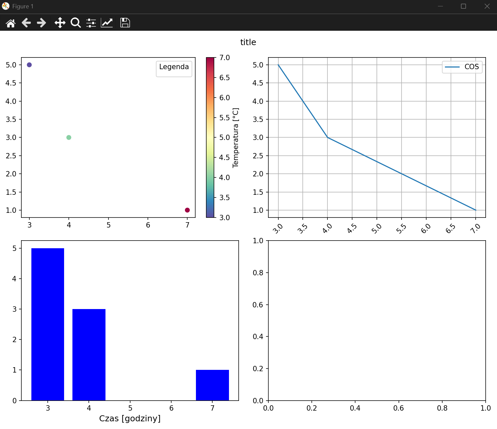

# Spis Treści
## Podstawy Pythona
1. [Podstawowe elementy składni w Pythonie](#podstawowe-elementy-składni-w-pythonie)
2. [Typy danych i zmienne w Pythonie](#typy-danych-i-zmienne-w-pythonie)
3. [Operatory w Pythonie](#operatory-w-pythonie)
4. [Struktury sterujące w Pythonie](#struktury-sterujące-w-pythonie)
5. [Funkcje w Pythonie](#funkcje-w-pythonie)
6. [Struktury danych w Pythonie](#struktury-danych-w-pythonie)
7. [Operacje wejścia/wyjścia oraz obsługa plików w Pythonie](#operacje-wejściawyjścia-oraz-obsługa-plików-w-pythonie)
8. [Moduły i importy w Pythonie](#moduły-i-importy-w-pythonie)
9. [Klasy w Pythonie](#klasy-w-pythonie)

## Curses w Pyhonie
1. [Wprowadzenie do curses](#wprowadzenie-do-curses)
2. [Podstawowe użycie](#podstawowe-użycie)
3. [Obsługa klawiatury w curses](#obsługa-klawiatury-w-curses)
4. [Kolory w curses](#kolory-w-curses)
5. [Obsługa myszy w curses](#obsługa-myszy-w-curses)

## Matplotlib w Pythonie
1. [Tworzenie wykresów i figur](#tworzenie-wykresów-i-figur)
2. [Rysowanie danych](#rysowanie-danych)
3. [Formatowanie i stylizacja wykresów](#formatowanie-i-stylizacja-wykresów)
4. [Zapisywanie wykresu do pliku](#zapisywanie-wykresu-do-pliku)
5. [Interakcja z użytkownikiem](#interakcja-z-użytkownikiem)

## Linki:

https://doc.qt.io/qtforpython-6/PySide6/QtWidgets/index.html#module-PySide6.QtWidgets \
https://requests.readthedocs.io/en/latest/user/quickstart/ \
https://matplotlib.org/3.5.3/api/_as_gen/matplotlib.pyplot.html


<h1 align="center" span style="color: lime">Podstawy Pythona</h1>

# Podstawowe elementy składni w Pythonie

### Struktura programu

W Pythonie kod jest wykonywany od góry do dołu, a więc nie ma potrzeby definiowania funkcji main(), jak w C++ czy Java. Jednak konwencjonalnie stosuje się poniższy zapis.
```py
def main():
    print("Witaj w Pythonie!")

if __name__ == "__main__":
    main()
```

Blok `if __name__ == "__main__":` oznacza, że kod w nim zawarty zostanie wykonany tylko wtedy, gdy plik uruchamiany jest bezpośrednio, a nie importowany jako moduł.

### Zasady dotyczące wielkości liter

Python rozróżnia wielkość liter. Oznacza to, że zmienne `zmienna` i `Zmienna` to dwa różne obiekty. To samo dotyczy nazw funkcji i klas.

```py
a = 10
A = 20
print(a)  # 10
print(A)  # 20
```

### Komentarze

```py
# To jest komentarz jednoliniowy
"""
To jest wieloliniowy komentarz,
który może być użyty do opisu kodu.
"""
```

# Typy danych i zmienne w Pythonie

### Deklaracja i inicjalizacja zmiennych

W Pythonie nie trzeba deklarować typu zmiennej – Python sam go określa na podstawie przypisanej wartości.

```py
x = 10              # int
y = 3.14            # float
z = "Hello"         # str
is_python = True    # bool
```
Można też przypisać wiele wartości na raz.
```py
a, b, c = 1, 2.5, "tekst"
```

Typ | Opis|Przykład
--|--|--|
`int`|Liczby całkowite|`x = 42`
`float`|	Liczby zmiennoprzecinkowe|`y = 3.14`
`str`|	Ciągi znaków	|`text = "Python"`
`bool`|	Wartości logiczne	|`flag = True`
`list`|	Lista (tablica dynamiczna)	|`numbers = [1, 2, 3]`
`tuple`|	Krotka (niemutowalna lista)	|`coords = (10, 20)`
`dict`|	Słownik (klucz-wartość)	|`data = {"name": "Alice", "age": 25}`
`set`|	Zbiór unikalnych wartości	|`unique = {1, 2, 3, 3}`

### Sprawdzanie typu zmiennej

Aby sprawdzić typ zmiennej, używamy funkcji type().
```py
x = 10
print(type(x))      # output: <class 'int'>
```

### Konwersja typów

Python pozwala na konwersję między typami.

```py
a = "100"
b = int(a)          # Konwersja na int
c = float(a)        # Konwersja na float
d = str(b)          # Konwersja na string
```

### Stałe

W Pythonie nie ma słowa kluczowego const, ale stosuje się konwencję – nazwy stałych zapisuje się WIELKIMI_LITERAMI. Nie są one chronione przed zmianą, ale konwencja mówi, że nie powinny być modyfikowane.
```py
PI = 3.14159
GRAVITY = 9.81
```

# Operatory w Pythonie

Python obsługuje różne rodzaje operatorów, które służą do wykonywania operacji na zmiennych i wartościach.

### Operatory arytmetyczne

Służą do wykonywania podstawowych operacji matematycznych.

Operator	|Opis	|Przykład (`a = 10`, `b = 3`)	|Wynik
--|--|--|--
`+`	|Dodawanie	|`a + b`	|`13`
`-`	|Odejmowanie	|`a - b`	|`7`
`*`	|Mnożenie	|`a * b`	|`30`
`/`	|Dzielenie (wynik float)	|`a / b`	|`3.3333...`
`//`	|Dzielenie całkowite	|`a // b`	|`3`
`%`	|Reszta z dzielenia (modulo)	|`a % b`	|`1`
`**`	|Potęgowanie	|`a ** b`	|`1000`

### Operatory porównania

Porównują wartości i zwracają `True` lub `False`.

Operator	|Opis	|Przykład (`a = 10`, `b = 3`)	|Wynik
--|--|--|--
`==`	|Równość	|`a == b`	|`False`
`!=`	|Nierówność	|`a != b`	|`True`
`>`	|Większe niż	|`a > b`	|`True`
`<`	|Mniejsze niż	|`a < b`	|`False`
`>=`	|Większe lub równe	|`a >= b`	|`True`
`<=`	|Mniejsze lub równe	|`a <= b`	|`False`

### Operatory logiczne

Służą do operacji na wartościach `True` i `False`.

Operator	|Opis	|Przykład (`x = True`, `y = False`)	|Wynik
--|--|--|--
`and`	|Zwraca `True`, jeśli oba warunki są `True`	|`x and y`	|`False`
`or`	|Zwraca `True`, jeśli przynajmniej jeden warunek jest `True`	|`x or y`	|`True`
`not`	|Negacja wartości logicznej	|`not x`	|`False`

### Operatory bitowe

Działają na poziomie bitów (`0` i `1`).

Operator	|Opis	|Przykład (`a = 5` → `0101`, `b = 3` → `0011`)	|Wynik
--|--|--|--
`&`	|AND bitowy	|`a & b`	|`0001` (1)
`\|`   |OR bitowe: |`a \| b`  |`0111` (7)
`^`	|XOR bitowy	|`a ^ b`	|`0110` (6)
`~`	|Negacja bitowa	|`~a`	|(-6, bo U2 na 32 bit)
`<<`	|Przesunięcie bitowe w lewo	|`a << 1`	|`1010` (10)
`>>`	|Przesunięcie bitowe w prawo	|`a >> 1`	|`0010` (2)

### Operatory przypisania

Skrócony zapis operacji przypisania.

Operator	|Opis	|Przykład (`a = 5`)	|Wynik
--|--|--|--
`=`	|Przypisanie wartości	|`a = 5`	|`a = 5`
`+=`	|Dodanie i przypisanie	|`a += 3`	|`a = 8`
`-=`	|Odjęcie i przypisanie	|`a -= 2`	|`a = 3`
`*=`	|Mnożenie i przypisanie	|`a *= 2`	|`a = 10`
`/=`	|Dzielenie i przypisanie	|`a /= 2`	|`a = 2.5`
`//=`	|Dzielenie całkowite i przypisanie	|`a //= 2`	|`a = 2`
`%=`	|Modulo i przypisanie	|`a %= 3`	|`a = 2`
`**=`	|Potęgowanie i przypisanie	|`a **= 2`	|`a = 25`
`&=`	|AND bitowe i przypisanie	|`a &= 3`	|`a = 1`
`\|=`	|OR bitowe i przypisanie	|`a \|=3`   |`a=7`
`^=`	|XOR bitowe i przypisanie	|`a ^= 3`	|`a = 6`
`<<=`	|Przesunięcie bitowe w lewo i przypisanie	|`a <<= 1`	|`a = 10`
`>>=`	|Przesunięcie bitowe w prawo i przypisanie	|`a >>= 1`	|`a = 2`

# Struktury sterujące w Pythonie

Python obsługuje standardowe konstrukcje sterujące, takie jak instrukcje warunkowe i pętle.

### Instrukcje warunkowe (`if`, `elif`, `else`).

Zasady składni:
1. Brak nawiasów klamrowych – Python używa wcięć do oznaczania bloków kodu.
2. `elif` zamiast `else if` – skrócona wersja w Pythonie.

```py
x = 10

if x > 0:
    print("Liczba jest dodatnia")
elif x < 0:
    print("Liczba jest ujemna")
else:
    print("Liczba to zero")
```

Skrócona wersja warunku (operator trójargumentowy).
```py
x = 10
status = "dodatnia" if x > 0 else "nie-dodatnia"
print(status)       # "dodatnia"
```

### Pętla `for`

Przydatna podczas iteracji po kolekcjach (`list`, `tuple`, `dict`, `set`, `str`).

Przykład iteracji po liście:
```py
numbers = [1, 2, 3, 4, 5]

for num in numbers:
    print(num)
```

### Pętla `for` z `range()`
Zakresy:
- `range(5)` → `0, 1, 2, 3, 4`
- `range(2, 6)` → `2, 3, 4, 5`
- `range(0, 10, 2)` → `0, 2, 4, 6, 8` (skok co 2)

```py
for i in range(5):  # Generuje liczby od 0 do 4
    print(i)
```

### Pętla `while`

Wykonuje kod, dopóki warunek jest prawdziwy.

```py
x = 0

while x < 5:
    print(x)
    x += 1
```
#### Pętla nieskończona (`while True`)

```py 
while True:
    print("Działa!")
    break           # Przerywa pętlę
```

### `break` i `continue`

- `break` – przerywa pętlę.
- `continue` – pomija resztę kodu i przechodzi do kolejnej iteracji.
```py
for i in range(10):
    if i == 5:
        break       # Przerywa pętlę, gdy i = 5
    print(i)
```
```py
for i in range(5):
    if i == 2:
        continue    # Pomija i = 2
    print(i)
```
# Funkcje w Pythonie
Funkcje w Pythonie pozwalają na grupowanie kodu w bloki, które można wielokrotnie wywoływać.

### Definiowanie funkcji (`def`)
Funkcję tworzymy za pomocą słowa kluczowego `def`.
```py
def powitanie():
    print("Cześć, świecie!")

powitanie()         # Wywołanie funkcji
```
### Funkcja z argumentami
Możemy przekazywać wartości do funkcji jako argumenty.
```py
def powitanie(imie):
    print(f"Cześć, {imie}!")

powitanie("Ania")   # Cześć, Ania!
powitanie("Tomek")  # Cześć, Tomek!
```
### Domyślne wartości argumentów
Jeśli argument nie zostanie podany, użyta zostanie wartość domyślna.
```py
def powitanie(imie="Gość"):
    print(f"Cześć, {imie}!")

powitanie()         # Cześć, Gość!
powitanie("Kasia")  # Cześć, Kasia!
```
### Zwracanie wartości (`return`)
Funkcja może zwracać wartość za pomocą `return`.
```py
def suma(a, b):
    return a + b

wynik = suma(3, 7)
print(wynik)        # 10
```
### Argumenty pozycyjne i nazwane
Pozycyjne (`*args`) – dowolna liczba argumentów.
```py
def suma(*liczby):
    return sum(liczby)

print(suma(1, 2, 3))        # 6
print(suma(5, 10, 15, 20))  # 50
```
Nazwane (`**kwargs`) – argumenty w formie klucz-wartość.
```py
def dane_osoby(**info):
    for klucz, wartosc in info.items():
        print(f"{klucz}: {wartosc}")

dane_osoby(imie="Ania", wiek=25, miasto="Warszawa")
# output:
# imie: Ania
# wiek: 25
# miasto: Warszawa
```
### Funkcje anonimowe (`lambda`)
Służą do definiowania prostych funkcji w jednej linijce.
```py
kwadrat = lambda x: x ** 2
print(kwadrat(5))   # 25
```
### Zasięg zmiennych (`global`, `nonlocal`)
`global` – dostęp do zmiennej globalnej w funkcji.
```py
x = 10

def zmien_x():
    global x
    x = 20

zmien_x()
print(x)            # 20
```
`nonlocal` – zmiana zmiennej w funkcji zagnieżdżonej
```py
def zewnetrzna():
    x = 5
    def wewnetrzna():
        nonlocal x
        x += 1
    wewnetrzna()
    print(x)        # 6

zewnetrzna()
```
# Struktury danych w Pythonie
Python oferuje kilka podstawowych struktur danych: listy, krotki, zbiory i słowniki. Każda z nich ma inne zastosowanie.

## 1. Listy (`list`)

Lista to kolekcja elementów, które mogą być różnego typu. Jest ***mutowalna*** (można zmieniać jej elementy).

Tworzenie listy
```py
liczby = [1, 2, 3, 4, 5]
mieszana = [10, "tekst", 3.14, True]

print(liczby)           # [1, 2, 3, 4, 5]
```
Dodawanie elementów
```py
liczby = [1, 2, 3, 4, 5]
liczby.append(6)        # Dodaje na koniec
print(liczby)           # [1, 2, 3, 4, 5, 6]
liczby.insert(2, 99)    # Wstawia 99 na indeksie 2 
                        # (wszystkie elementy o indeksach większych i równemu temu na które się wstawia zostają zwiększone o 1)
print(liczby)           # [1, 2, 99, 3, 4, 5, 6]
```
Usuwanie elementów
```py
liczby = [1, 2, 3, 4, 5]
liczby.remove(3)        # Usuwa wartość 3
print(liczby)           # [1, 2, 4, 5]
ostatni = liczby.pop()  # Usuwa ostatni element i zwraca go
print(liczby)           # [1, 2, 4]
del liczby[0]           # Usuwa element o indeksie 0
print(liczby)           # [2, 4]
```
Iteracja po liście
```py
for liczba in liczby:
    print(liczba)
```
Filtrowanie listy (`list comprehension`)
```py
kwadraty = [x ** 2 for x in range(5)]
print(kwadraty)         # [0, 1, 4, 9, 16]
```
## 2. Krotki (`tuple`)
Krotki są ***niemutowalne*** – nie można zmieniać ich elementów po utworzeniu.

Tworzenie krotki
```py
krotka = (1, 2, 3, "tekst")
print(krotka[1])        # 2
```
Rozpakowywanie krotek
```py
a, b, c = (10, 20, 30)
print(a, b, c)          # 10 20 30
```
## 3. Zbiory (`set`)
Zbiory przechowują unikalne wartości i są nieuporządkowane.

Tworzenie zbioru
```py
zbior = {1, 2, 3, 3, 4}
print(zbior)            # {1, 2, 3, 4} (duplikaty są usuwane)
```
Operacje na zbiorach
```py
A = {1, 2, 3}
B = {3, 4, 5}

print(A | B)            # {1, 2, 3, 4, 5} (suma zbiorów)
print(A & B)            # {3} (część wspólna)
print(A - B)            # {1, 2} (różnica)
```
## 4. Słowniki (`dict`)
Słownik przechowuje dane w postaci ***klucz: wartość***.

Tworzenie słownika
```py
osoba = {"imie": "Ania", "wiek": 25, "miasto": "Warszawa"}
print(osoba["imie"])    # Ania
```
Dodawanie i usuwanie elementów
```py
osoba["email"] = "ania@example.com"     # Dodanie nowej pary
del osoba["wiek"]                       # Usunięcie klucza
```
Iteracja po słowniku
```py
for klucz, wartosc in osoba.items():
    print(f"{klucz}: {wartosc}")
```
# Operacje wejścia/wyjścia oraz obsługa plików w Pythonie
Operacje wejścia (input) i wyjścia (output) są kluczowe w programowaniu – pozwalają na interakcję użytkownika z programem oraz zapis i odczyt danych.

### Odczyt danych od użytkownika (`input()`)

Funkcja `input()` pozwala użytkownikowi wprowadzić dane z klawiatury. Domyślnie zwraca ciąg znaków (`str`).\
Przykład – pobieranie imienia od użytkownika
```py
imie = input("Podaj swoje imię: ")
print("Cześć,", imie)
```
Konwersja danych wejściowych
Jeśli użytkownik podaje liczbę, należy przekonwertować ją na odpowiedni typ.
```py
wiek = int(input("Podaj swój wiek: "))      # Konwersja na int
print("Za 5 lat będziesz miał", wiek + 5)
```
### Wyjście danych (`print()`)
Funkcja `print()` pozwala wyświetlić dane na ekranie.
```py
print("Witaj w programie!")
```
### Łączenie wielu argumentów (`sep`, `end`)
```py
print("Imię:", "Anna", sep="-")             # Imię:-Anna
print("Linia 1", end=" ")                   # end="" nie dodaje nowej linii
print("Linia 2")                            # Linia 1 Linia 2
```
### Formatowanie ciągów znaków (`f-stringi`)
```py
imie = "Jan"
wiek = 30
print(f"{imie} ma {wiek} lat.")  # Jan ma 30 lat.
```
### Operacje na plikach
Python pozwala na łatwe otwieranie, odczytywanie i zapisywanie plików. Można pracować z plikami tekstowymi (`.txt`), binarnymi (`.bin`) i innymi formatami.
### Otwieranie plików (`open`)
Pliki otwieramy za pomocą funkcji `open()`, podając nazwę pliku i tryb otwarcia.

Tryb	|Opis
--|--
`"r"`	|Odczyt (domyślnie)
`"w"`	|Zapis (usuwa zawartość pliku!)
`"a"`	|Dopisanie do pliku
`"x"`	|Tworzy nowy plik (błąd, jeśli istnieje)
`"b"`	|Tryb binarny (np. `"rb"`, `"wb"`)

Przykład – otwieranie pliku do odczytu
```py
plik = open("dane.txt", "r")            # Otwiera plik w trybie odczytu
tekst = plik.read()                     # Odczytuje całą zawartość
print(tekst)
plik.close()                            # Zamyka plik
```
### Odczytywanie pliku
Odczyt całego pliku (`read()`)
```py
with open("dane.txt", "r") as plik:
    zawartosc = plik.read()
    print(zawartosc)
```
Odczyt wiersz po wierszu (`readline()`, `readlines()`)
```py
with open("dane.txt", "r") as plik:
    for linia in plik:
        print(linia.strip())            # Usuwa znaki nowej linii
```
### Zapis do pliku
Tryb `"w"` (nadpisanie pliku)
```py
with open("nowy.txt", "w") as plik:
    plik.write("To jest nowa linia.\n")
```
Tryb `"a"` (dopisywanie)
```py
with open("nowy.txt", "a") as plik:
    plik.write("Dopisuję kolejną linię.\n")
```
### Tryb binarny
Dla plików graficznych, dźwiękowych itp.

Odczyt binarny
```py
with open("obraz.jpg", "rb") as plik:
    dane = plik.read()
```
Zapis binarny
```py
with open("kopiowany.jpg", "wb") as plik:
    plik.write(dane)
```
### Obsługa błędów (`try-except`)
Jeśli plik nie istnieje, program może zgłosić błąd.
```py
try:
    with open("brak.txt", "r") as plik:
        print(plik.read())
except FileNotFoundError:
    print("Plik nie istnieje!")
```
# Moduły i importy w Pythonie
Moduły w Pythonie pozwalają na organizowanie kodu w osobne pliki i ponowne ich użycie w różnych programach. Python ma też wiele wbudowanych modułów, które rozszerzają jego funkcjonalność.

### Importowanie modułów

Moduły importujemy za pomocą `import`.

Import całego modułu
```py
import math

print(math.sqrt(16))    # 4.0
```
Import konkretnej funkcji
```py
from math import sqrt

print(sqrt(25))         # 5.0
```
Import z aliasem (`as`)
```py
import math as m

print(m.pi)             # 3.141592653589793
```
### Tworzenie własnych modułów
Każdy plik `.py` może być modułem!

Plik `moj_modul.py`
```py
def powitanie(imie):
    return f"Cześć, {imie}!"
```
Użycie modułu w innym pliku
```py
import moj_modul

print(moj_modul.powitanie("Ania"))  # Cześć, Ania!
```
### Importowanie wszystkiego (`*`)
```py
from math import *

print(sin(0))           # 0.0
print(factorial(5))     # 120
```
> **Uwaga:** Nie zaleca się `from module import *`, bo może nadpisać inne funkcje o tej samej nazwie.
### Moduł `sys` – Argumenty wiersza poleceń
Moduł `sys` pozwala na odczyt argumentów podanych przy uruchamianiu skryptu.

Przykład (`sys.argv`)
```py
import sys

print("Argumenty:", sys.argv)
```
> Uruchomienie `python skrypt.py argument1 argument2` zwróci:\
> `Argumenty: ['skrypt.py', 'argument1', 'argument2']`
### Moduł `os` – Operacje na plikach i katalogach
Moduł `os` pozwala na zarządzanie plikami i katalogami.

Sprawdzenie plików w katalogu
```py
import os

print(os.listdir("."))              # Lista plików w bieżącym katalogu
```
Sprawdzenie, czy plik istnieje
```py
print(os.path.exists("plik.txt"))   # True / False
```
Tworzenie katalogu
```py
os.mkdir("nowy_folder")
```
Usunięcie pliku
```py
os.remove("plik.txt")
```
### Moduł random – Losowanie liczb
```py
import random

print(random.randint(1, 10))            # Losowa liczba 1-10
print(random.choice(["A", "B", "C"]))   # Losowy element listy
```
# Klasy w Pythonie

Klasy w Pythonie to podstawowy mechanizm programowania obiektowego, który pozwala na tworzenie własnych typów danych poprzez grupowanie zmiennych (atrybutów) i funkcji (metod) w jedną strukturę. Pozwalają one modelować rzeczywiste obiekty oraz ich zachowania.

### Tworzenie klasy
Klasę definiujemy za pomocą słowa kluczowego `class`
```py
class NazwaKlasy:
    def __init__(self, parametr1, parametr2):
        self.parametr1 = parametr1
        self.parametr2 = parametr2

    def metoda(self):
        print(f"Parametry: {self.parametr1}, {self.parametr2}")
```
#### Kluczowe elementy klasy:
1. Konstruktor (`__init__`)\
Specjalna metoda, która jest wywoływana przy tworzeniu obiektu danej klasy. Służy do inicjalizacji jego atrybutów.

2. Atrybuty (`self.nazwa_atrybutu`)\
Zmienne przypisane do konkretnej instancji klasy.

3. Metody (`def nazwa_metody(self)`)\
Funkcje zdefiniowane wewnątrz klasy, które operują na jej danych.

### Tworzenie obiektów klasy
Po zdefiniowaniu klasy możemy tworzyć jej obiekty
```py
obiekt = NazwaKlasy("wartość1", "wartość2")
obiekt.metoda()             # Wywołanie metody klasy
```

### Dziedziczenie klas
Python pozwala na tworzenie nowych klas na podstawie istniejących (tzw. dziedziczenie).
```py
class PochodnaKlasa(NazwaKlasy):
    def nowa_metoda(self):
        print("Nowa funkcja w klasie pochodnej")
```
Obiekt klasy `PochodnaKlasa` będzie miał zarówno metody swojej klasy, jak i odziedziczone metody z `NazwaKlasy`.

### Modyfikowanie metod (`super()`)
Aby wywołać metodę klasy nadrzędnej w klasie potomnej należy użyć metody `super()`. 
```py
class PochodnaKlasa(NazwaKlasy):
    def __init__(self, parametr1, parametr2, dodatkowy):
        super().__init__(parametr1, parametr2)
        self.dodatkowy = dodatkowy
```
Funkcja `super()` odwołuje się do klasy nadrzędnej i pozwala na używanie jej metod.

### Metody specjalne (dunder methods)
Python posiada wbudowane metody specjalne, które umożliwiają dostosowanie zachowania obiektów. Najczęściej stosowane to:
- `__init__` – konstruktor
- `__str__` – reprezentacja tekstowa obiektu
- `__len__` – implementacja len()
- `__add__` – obsługa + dla obiektów

```py
class Przedmiot:
    def __init__(self, nazwa, waga):
        self.nazwa = nazwa
        self.waga = waga

    def __str__(self):
        return f"Przedmiot: {self.nazwa}, Waga: {self.waga} kg"

p = Przedmiot("Miecz", 3)
print(p)  # Wywoła __str__()
```

### Własności (`@property`)
Python pozwala na tworzenie atrybutów tylko do odczytu.
```py
class Postac:
    def __init__(self, imie, poziom):
        self._poziom = poziom  # Konwencja: "_" oznacza atrybut "prywatny"

    @property
    def poziom(self):
        return self._poziom  # Zwraca wartość atrybutu
```
Dzięki `@property`, poziom można odczytać, ale nie można go zmieniać.


<h1 align="center" span style="color: lime">Curses w Pyhonie</h1>


# Wprowadzenie do `curses`
Moduł `curses` jest biblioteką do tworzenia interfejsów tekstowych w terminalu. Umożliwia dynamiczne odświeżanie ekranu, obsługę klawiatury, pracę z kolorami oraz tworzenie okien i ramek. `curses` jest często wykorzystywany w aplikacjach konsolowych, takich jak gry roguelike, menedżery plików czy interaktywne narzędzia terminalowe.

📌 Kluczowe cechy `curses`:\
✔️ Praca w trybie pełnoekranowym w terminalu\
✔️ Obsługa dynamicznych zmian wyświetlania\
✔️ Możliwość używania kolorów i stylów tekstu\
✔️ Obsługa różnych urządzeń wejściowych, w tym klawiatury

# Podstawowe użycie
Minimalny przykład uruchomienia `curses`
```py
import curses

def main(stdscr):
    stdscr.clear()
    stdscr.addstr(0, 0, "Witaj w curses!")

    # Przykład jak wycentrować tekst na ekranie
    height, width = stdscr.getmaxyx()                           # Pobranie rozmiaru terminala
    msg = "Rozmiar terminala: {}x{}".format(height, width)
    stdscr.addstr(height // 2, (width - len(msg)) // 2, msg)    # Wycentrowanie tekstu
    
    stdscr.refresh()
    stdscr.getch()

if __name__ == '__main__':
    curses.wrapper(main)
```
Opis działania:
- `stdscr` - główne okno ekranu
- `stdscr.clear()` - usuwa wcześniejsze rysunki, zapobiegając nakładaniu znaków
- `stdscr.addstr(y, x, "tekst")` – wyświetlenie tekstu na ekranie
- `stdscr.refresh()` – odświeżenie ekranu po zmianach
- `stdscr.getch()` – czeka na naciśnięcie klawisza przed zakończeniem
- `curses.wrapper(main)` - Funkcja `wrapper()` zapewnia poprawne uruchomienie `curses` i automatycznie resetuje terminal po zakończeniu programu. Dzięki temu unikamy problemów z pozostawieniem terminala w trybie `curses` po wystąpieniu błędu.    
- `stdscr.getmaxyx()` - zwraca wymiary terminala 

# Obsługa klawiatury w `curses`
Moduł `curses` pozwala na odczyt klawiatury przy użyciu `getch()`. Możemy obsługiwać zarówno standardowe znaki ASCII, jak i specjalne klawisze.

### Podstawowy odczyt klawiszy
```py
import curses

def main(stdscr):
    stdscr.addstr(0, 0, "Naciśnij klawisz (q aby wyjść)")
    while True:
        key = stdscr.getch()    # Odczytaj naciśnięty klawisz
        if key == ord('q'):     # Sprawdź, czy to 'q'
            break
        stdscr.addstr(1, 0, f"Naciśnięto: {chr(key)}    ")
        stdscr.refresh()

if __name__ == '__main__':
    curses.wrapper(main)
```
`ord('q')` zwraca kod ASCII litery 'q', dzięki czemu porównujemy bezpośrednio wartość liczbową.

### Obsługa specjalnych klawiszy (np. strzałek)
`curses` posiada stałe wartości dla klawiszy specjalnych, np. `curses.KEY_UP`, `curses.KEY_DOWN`.
```py
import curses

def main(stdscr):
    stdscr.addstr(0, 0, "Użyj strzałek do poruszania się, 'q' aby wyjść")
    y, x = 2, 5  # Początkowa pozycja
    while True:
        key = stdscr.getch()
        if key == ord('q'):
            break
        elif key == curses.KEY_UP:
            y = max(1, y - 1)
        elif key == curses.KEY_DOWN:
            y = min(10, y + 1)
        elif key == curses.KEY_LEFT:
            x = max(1, x - 1)
        elif key == curses.KEY_RIGHT:
            x = min(30, x + 1)
        stdscr.clear()
        stdscr.addstr(y, x, "@")
        stdscr.refresh()

if __name__ == '__main__':
    curses.wrapper(main)
```
`curses.KEY_UP`, `curses.KEY_DOWN`, `curses.KEY_LEFT`, `curses.KEY_RIGHT` – stałe dla klawiszy kierunkowych.
# Kolory w `curses`
Domyślnie terminal obsługuje tylko biały tekst na czarnym tle, ale `curses` pozwala na definiowanie kolorów.
### Inicjalizacja kolorów
Przed użyciem kolorów należy wywołać curses.start_color(), a potem zdefiniować pary kolorów.

```py
import curses

def main(stdscr):
    curses.start_color()
    curses.init_pair(1, curses.COLOR_RED, curses.COLOR_BLACK)
    curses.init_pair(2, curses.COLOR_GREEN, curses.COLOR_BLACK)

    stdscr.addstr(0, 0, "Czerwony tekst", curses.color_pair(1))
    stdscr.addstr(1, 0, "Zielony tekst", curses.color_pair(2))
    stdscr.refresh()
    stdscr.getch()

if __name__ == '__main__':
    curses.wrapper(main)
```
`curses.init_pair(1, curses.COLOR_RED, curses.COLOR_BLACK)` - definiuje kolor tekstu i tła.\
`curses.color_pair(1)` – wybiera wcześniej zdefiniowaną parę kolorów.

# Obsługa myszy w `curses`
Moduł `curses` pozwala na obsługę myszy, w tym wykrywanie kliknięć, przewijania oraz ruchu kursora. Do tego celu wykorzystuje funkcję `curses.mousemask()`, która określa, jakie zdarzenia myszy mają być rejestrowane.

***Konfiguracja obsługi myszy***\
Aby włączyć obsługę myszy, należy:
- Ukryć kursor – `curses.curs_set(0)`, aby nie przeszkadzał w interfejsie.
- Włączyć obsługę myszy – `curses.mousemask(curses.ALL_MOUSE_EVENTS | curses.REPORT_MOUSE_POSITION)`, aby rejestrować kliknięcia i ruch.
- Odczytać zdarzenia – `curses.getch()` + `curses.getmouse()` w celu przechwycenia interakcji.

### Rejestrowanie kliknięć myszy
Poniższy program wyświetla koordynaty kliknięcia w terminalu.
```py
import curses

def main(stdscr):
    curses.curs_set(0)  # Ukrycie kursora
    curses.mousemask(curses.ALL_MOUSE_EVENTS | curses.REPORT_MOUSE_POSITION)  # Rejestrowanie wszystkich zdarzeń myszy

    stdscr.addstr(0, 0, "Kliknij gdziekolwiek myszką (q aby wyjść)")

    while True:
        key = stdscr.getch()
        
        if key == ord('q'):
            break  # Wyjście po naciśnięciu 'q'
        
        if key == curses.KEY_MOUSE:  # Sprawdzenie, czy zdarzenie dotyczy myszy
            _, x, y, _, bstate = curses.getmouse()  # Pobranie informacji o kliknięciu
            
            stdscr.clear()
            stdscr.addstr(0, 0, "Kliknij gdziekolwiek myszką (q aby wyjść)")
            stdscr.addstr(y, x, "X")  # Rysowanie znaku na pozycji kliknięcia

            # Sprawdzenie typu kliknięcia
            if bstate & curses.BUTTON1_PRESSED:
                stdscr.addstr(2, 0, f"LPM kliknięte na ({x}, {y})")
            if bstate & curses.BUTTON3_PRESSED:
                stdscr.addstr(3, 0, f"PPM kliknięte na ({x}, {y})")
            if bstate & curses.BUTTON2_PRESSED:
                stdscr.addstr(4, 0, f"Środkowy przycisk kliknięty na ({x}, {y})")
            if bstate & curses.BUTTON4_PRESSED:
                stdscr.addstr(5, 0, "Scroll w górę")
            if bstate & curses.BUTTON5_PRESSED:
                stdscr.addstr(6, 0, "Scroll w dół")

            stdscr.refresh()

if __name__ == '__main__':
    curses.wrapper(main)
```
`curses.KEY_MOUSE` – sprawdza, czy zdarzenie pochodzi od myszy.\
`curses.getmouse()` – zwraca (id_kliknięcia, x, y, z, bstate), gdzie bstate określa rodzaj zdarzenia.\
`curses.BUTTON1_PRESSED`, `BUTTON3_PRESSED`, `BUTTON4_PRESSED` itd. - pozwalają rozpoznać, który przycisk został naciśnięty.\
`stdscr.addstr(y, x, "X")` – rysuje znak X w miejscu kliknięcia.


<h1 align="center" span style="color: lime">Matplotlib w Pythonie</h1>

## Tworzenie wykresów i figur

### 1. `plt.subplots()`
**Opis:**\
Tworzy nową figurę (`Figure`) oraz zestaw osi (`Axes`). Umożliwia łatwe tworzenie układów wielopodziałowych (`subplots`).\
**Składnia:**
```py
fig, ax = plt.subplots(nrows=1, ncols=1, sharex=False, sharey=False,
                       squeeze=True, subplot_kw=None, gridspec_kw=None,
                       **fig_kw)
```
Parametry:
- `nrows`, `ncols` (int): liczba wierszy i kolumn w układzie subplots.
- `sharex`, `sharey` (bool lub {'row', 'col', 'all', 'none'}): określa, czy osie X i Y mają być współdzielone między subplotami.
- `squeeze` (bool): jeśli True, zwraca obiekt Axes zamiast tablicy, gdy jest tylko jeden subplot.
- `subplot_kw` (dict): dodatkowe argumenty przekazywane do każdej osi (Axes).
- `gridspec_kw` (dict): dodatkowe argumenty przekazywane do GridSpec.
- `**fig_kw`: dodatkowe argumenty przekazywane do `figure()`.

**Przykład:**
```py
fig, ax = plt.subplots(nrows=2, ncols=2, figsize=(10, 8), dpi=100)
```
### 2. `plt.figure()`
**Opis:**\
Tworzy nową figurę (`Figure`) lub aktywuje istniejącą.\
**Składnia:**
```py
fig = plt.figure(num=None, figsize=None, dpi=None, facecolor=None,
                 edgecolor=None, frameon=True, FigureClass=<class 'matplotlib.figure.Figure'>,
                 clear=False, tight_layout=False, constrained_layout=False)
```
**Parametry:**
- `num` (int lub str): identyfikator figury; jeśli figura o podanym numerze istnieje, zostanie aktywowana.
- `figsize` (tuple): rozmiar figury w calach (szerokość, wysokość).
- `dpi` (int): rozdzielczość figury w punktach na cal.
- `facecolor`, `edgecolor` (str lub kolor): kolor tła i krawędzi figury.
- `frameon` (bool): czy rysować ramkę wokół figury.
- `clear` (bool): czy wyczyścić istniejącą figurę o podanym numerze.

**Przykład:**
```py
fig = plt.figure(figsize=(8, 6), dpi=100, facecolor='white')
```
### 3. plt.show()
**Opis:**\
Wyświetla wszystkie otwarte figury. W środowiskach interaktywnych (np. Jupyter Notebook) może nie być konieczne.

**Składnia:**
```py
plt.show(block=True)
```
**Parametry:**

- `block` (bool): jeśli True, blokuje wykonanie kodu do momentu zamknięcia wszystkich figur.

**Przykład:**
```py
plt.show()
```
### 4. `fig.canvas.mpl_connect()`
**Opis:**\
Rejestruje funkcję obsługi zdarzeń (np. kliknięć, naciśnięć klawiszy) dla figury.

**Składnia:**
```py
cid = fig.canvas.mpl_connect(event, callback)
```
**Parametry:**
- `event` (str): nazwa zdarzenia, np. 'button_press_event', 'key_press_event'.
- `callback` (funkcja): funkcja wywoływana po wystąpieniu zdarzenia.

**Przykład:**
```py
def on_click(event):
    print(f"Kliknięto w punkcie: ({event.xdata}, {event.ydata})")

cid = fig.canvas.mpl_connect('button_press_event', on_click)
```
### 5. `fig.canvas.draw()`
**Opis:**\
Rysuje lub odświeża figurę. Przydatne po dokonaniu zmian w danych lub wyglądzie wykresu.

**Składnia:**
```py
fig.canvas.draw()
```
**Przykład:**
```py
# Po aktualizacji danych na wykresie
fig.canvas.draw()
```

## Rysowanie danych
### 1. `ax.plot()`
**Opis:**\
Rysuje wykres liniowy, łącząc kolejne punkty prostymi liniami. Bardzo uniwersalna metoda do prezentacji danych czasowych, zmian temperatury itp.

**Składnia:**
```py
ax.plot(x, y, fmt='', data=None, **kwargs)
```
**Parametry:**
- `x`, `y`: dane na osie X i Y.
- `fmt` (str): skrócona notacja stylu linii i punktów (np. "ro" – czerwone kropki).
- `label` (str): etykieta serii danych (używana w legendzie).
- `color` (str): kolor linii (np. 'red', '#ff0000').
- `linewidth` (float): grubość linii.
- `linestyle` (str): styl linii ('-', '--', ':', '-.').

**Przykład:**
```py
ax.plot(godziny, temperatury, label="Temperatura", color="red", linewidth=2)
```
### 2. `ax.bar()`
**Opis:**\
Tworzy wykres słupkowy (kolumnowy). Używany np. do wizualizacji opadów.

**Składnia:**
```py
ax.bar(x, height, width=0.8, bottom=None, align='center', **kwargs)
```
**Parametry:**
- `x`: pozycje słupków na osi X.
- `height`: wysokość każdego słupka (czyli wartość na osi Y).
- `width`: szerokość słupków.
- `color`, label, alpha itd. — typowe właściwości wykresu.

**Przykład:**
```py
ax.bar(dni, opady, color='blue', label='Opady')
```
### 3. `ax.scatter()`
**Opis:**\
Tworzy wykres punktowy (rozrzutu), często z kolorowaniem punktów w zależności od wartości (np. temperatura w miastach).

**Składnia:**
```py
sc = ax.scatter(x, y, c=None, s=None, cmap=None, alpha=None, **kwargs)
```
**Parametry:**
- `x`, `y`: współrzędne punktów.
- `c`: kolory (np. lista temperatur).
- `s`: wielkość punktów.
- `cmap`: nazwa mapy kolorów (np. 'Spectral_r').
- `alpha`: przezroczystość punktów.

**Przykład:**
```py
sc = ax.scatter(longitudes, latitudes, c=temperatures, cmap="Spectral_r")
```
### 4. `ax.text()`
**Opis:**\
Umieszcza tekst w danym punkcie wykresu (np. etykiety miast).

**Składnia:**
```py
ax.text(x, y, s, fontsize=None, bbox=None, ha='left', va='bottom', **kwargs)
```
**Parametry:**
- `x`, `y`: pozycja tekstu.
- `s`: tekst do wyświetlenia.
- `fontsize`: rozmiar czcionki.
- `bbox`: ramka wokół tekstu — słownik ze stylami np.:
    ```py
    bbox=dict(boxstyle="round", fc="white", alpha=0.5)
    ```
- `ha`, `va`: wyrównanie poziome i pionowe (`'center'`, `'left'`, `'top'`, itd.).
**Przykład:**
```py
ax.text(21.0122, 52.2297, "Warszawa\n15°C", ha='center',
        bbox=dict(boxstyle="round,pad=0.2", fc="white", alpha=0.3))
```
### 5. `ax.axvspan()`
**Opis:**\
Rysuje pionowy, wypełniony prostokąt (obszar między xmin a xmax) — np. dla oznaczenia zakresu czasu, nocy, dnia itd.

**Składnia:**
```py
ax.axvspan(xmin, xmax, ymin=0, ymax=1, facecolor='blue', alpha=0.2)
```
**Parametry:**
- `xmin`, `xmax`: granice prostokąta na osi X.
- `ymin`, `ymax`: pionowe ograniczenia (domyślnie cała wysokość wykresu).
- `facecolor`: kolor wypełnienia.
- `alpha`: przezroczystość.

**Przykład:**
```py
ax.axvspan(start_hour, end_hour, facecolor='gray', alpha=0.2)
```
### 6. `fig.colorbar()`
**Opis:**\
Dodaje legendę kolorów (np. dla wykresu punktowego). Automatycznie pokazuje zakres wartości przypisanych do kolorów.

**Składnia:**
```py
fig.colorbar(mappable, ax=None, orientation='vertical', label='')
```
**Parametry:**
- `mappable`: obiekt wykresu zawierający dane kolorów, np. wynik ax.scatter().
- `ax`: oś, do której ma być przypisana legenda.
- `orientation`: 'vertical' lub 'horizontal'.
- `label`: podpis pod skalą.

**Przykład:**
```py
sc = ax.scatter(x, y, c=temps, cmap="coolwarm")
fig.colorbar(sc, ax=ax, label="Temperatura [°C]")
```
### 7. `ax.clear()`
**Opis:**\
Usuwa wszystkie elementy z osi (wykresy, teksty, siatki, legendy itd.). Oś pozostaje aktywna i gotowa do ponownego rysowania\
**Parametry:**\
Nie przyjmuje żadnych parametrów.\
**Przykład:**
```py
ax.clear()
```
#### Inne powiązane metody
Metoda	|Opis
--|--
`ax.cla()`|	To to samo co clear() (synonim — starsza wersja)
`fig.clf()`|	Czyści całą figurę (czyli wszystkie osie w niej zawarte)
`plt.cla()`|	Czyści aktywną oś
`plt.clf()`|	Czyści aktywną figurę
## Formatowanie i stylizacja wykresów
### 1. `ax.grid()`
**Opis:**\
Włącza siatkę pomocniczą (linie poziome i/lub pionowe) w tle wykresu — ułatwia odczyt wartości.

**Składnia:**
```py
ax.grid(visible=True, which='major', axis='both', linestyle='-', color='gray', alpha=0.5)
```
**Parametry:**
- `visible` (bool): czy siatka ma być widoczna.
- `which`: 'major', 'minor' lub 'both' — wybór typu podziałki.
- `axis`: 'x', 'y' lub 'both'.
- `linestyle`: styl linii (np. '--', ':').
- `color`: kolor linii siatki.
- `alpha`: przezroczystość.

**Przykład:**
```py
ax.grid(True)
```
### 2. `ax.set_xlabel()` i `ax.set_ylabel()`
**Opis:**\
Ustawiają etykiety osi X i Y.

**Składnia:**
```py
ax.set_xlabel("Czas [godziny]", fontsize=12)
ax.set_ylabel("Temperatura [°C]", fontsize=12)
```
**Parametry:**
- `label` (str): tekst etykiety.
- `fontsize` (int): rozmiar czcionki.
- `labelpad` (float): odstęp od osi.

**Przykład:**
```py
ax.set_xlabel("Godzina")
ax.set_ylabel("Temperatura [°C]")
```
### 3. `ax.legend()`
**Opis:**\
Dodaje legendę opisującą serie danych (np. linie na wykresie).

**Składnia:**
```py
ax.legend(loc='upper right', title='Legenda', fontsize=10)
```
**Parametry:**
- `loc`: pozycja legendy (np. 'upper left', 'lower right').
- `title`: tytuł legendy.
- `fontsize`: rozmiar czcionki.

***Uwaga:*** Wymaga, aby przy `plot()` lub `bar()` przekazano `label=....`

**Przykład:**
```py
ax.plot(x, y, label="Temperatura")
ax.legend()
```
### 4. `ax.tick_params()`
Opis:
Umożliwia ustawienie stylu etykiet i znaczników osi (np. rotacja etykiet na osi X).

**Składnia:**
```py
ax.tick_params(axis='x', labelrotation=45)
```
**Parametry:**
- `axis`: 'x', 'y', 'both'.
- `labelrotation`: obrót etykiet (w stopniach).
- `labelsize`: rozmiar etykiet.
- `length`: długość znaczników.
- `width`: grubość znaczników.

**Przykład:**
```py
ax.tick_params(axis="x", labelrotation=45)
```
### 5. `plt.title()`
**Opis:**
Dodaje tytuł nad całym wykresem.

**Składnia:**
```py
plt.title("Tygodniowa prognoza pogody", fontsize=14)
```
**Parametry:**
- `label` (str): tekst tytułu.
- `fontsize` (int): rozmiar czcionki.
- `loc`: pozycja ('center', 'left', 'right').

***Uwaga:*** `plt.title()` działa tylko wtedy, gdy tworzymy pojedynczy wykres (jeden Axes), a nie układ subplotów. Gdy mamy wiele wykresów, tytuł powinien być ustawiony globalnie dla całej figury, a nie pojedynczego wykresu, więc należy użyć `plt.suptitle()`.

**Przykład:**
```py
plt.title("Temperatura w Warszawie")
```
### 6. `plt.tight_layout()`
**Opis:**\
Automatycznie dopasowuje rozmieszczenie elementów figury, tak by nie nachodziły na siebie (np. etykiety osi i tytuły).

**Składnia:**
```py
plt.tight_layout(pad=1.0)
```
**Parametry:**
- `pad` (float): odstęp między wykresami.
- `h_pad`, `w_pad`: odstępy w pionie/poziomie.
- `rect`: ograniczenie do fragmentu figury.

**Przykład:**
```py
plt.tight_layout()
```
### 7. `fig.set_label()`
**Opis:**\
Ustawia etykietę (opis tekstowy) obiektu Figure. W Twoim kodzie używane do oznaczenia klikniętego miasta — choć nie wyświetla się domyślnie na wykresie.

**Składnia:**
```py
fig.set_label("Warszawa")
```
**Zastosowanie:**
Można wykorzystać w integracji z GUI lub logiką wewnętrzną aplikacji do identyfikacji figury.

**Przykład:**
```py
self.fig.set_label(city[0])  # np. "Poznań"
```
W Twoim kodzie używane do zapisania klikniętej nazwy miasta — można to potem odczytać przez `fig.get_label()`
## Zapisywanie wykresu do pliku 
### `fig.savefig()`
**Opis:**\
Metoda `savefig()` zapisuje obiekt Figure (czyli cały wykres, włącznie z osiami, legendą, tytułami itd.) do pliku graficznego lub wektorowego (np. PNG, JPG, PDF, SVG, EPS).
**Składnia:**
```py
fig.savefig(fname, dpi=None, facecolor='w', edgecolor='w',
            orientation='portrait', format=None,
            transparent=False, bbox_inches=None,
            pad_inches=0.1, metadata=None)
```
Parametry:
Parametr	|Typ|	Opis
--|--|--
`fname`	|`str` lub `Path` lub `file-like`	|Nazwa pliku lub obiekt plikowy, np. `"wykres.png"`
`dpi`	|`int`	|Rozdzielczość zapisu w dpi (np. 300 dla druku)
`format`|	`str`|	Format pliku, np. 'png', 'pdf', 'svg' (domyślnie odczytywany z rozszerzenia pliku)
`transparent`|	`bool`|	Czy tło ma być przezroczyste
`facecolor`|	`str` lub `tuple`|	Kolor tła wykresu
`edgecolor`|	`str` lub `tuple`|	Kolor ramki
`bbox_inches`|	`'tight'` lub `None`|	Dopasowanie rozmiaru figury do zawartości (użyteczne np. dla etykiet)
`pad_inches`|	`float`	|Margines wokół wykresu (działa z `bbox_inches='tight'`)
`metadata`|	`dict`	|Dane dodatkowe zapisane w pliku (np. autor, tytuł, opis — dla PDF/SVG)
 
**Przykłady użycia:**
- Zapis domyślny (do PNG):
    ```py
    fig.savefig("mapa_polski.png")
    ```
-  Z większą rozdzielczością i przezroczystym tłem:
    ```py
    fig.savefig("wykres_temp.png", dpi=300, transparent=True)
    ```
- Automatyczne dopasowanie rozmiaru do zawartości:
    ```py
    fig.savefig("wykres_temp.png", bbox_inches='tight')
    ```
- Zapis do formatu wektorowego (np. PDF):
    ```py
    fig.savefig("raport.pdf", format="pdf")
    ```

Uwagi:
- Jeśli nie podasz dpi, używana jest domyślna wartość z konfiguracji matplotlib (np. 100).
- Funkcja nie wyświetla wykresu — tylko zapisuje go do pliku.
- Aby zapisać aktualnie aktywną figurę bez odwoływania się do obiektu fig, można też użyć:
    ```py
    plt.savefig("plik.png")
    ```

## Interakcja z użytkownikiem
### 1. `fig.canvas.mpl_connect(event, callback)`
**Opis:**
Rejestruje zdarzenie (np. kliknięcie myszą, naciśnięcie klawisza) i przypisuje mu funkcję obsługi, czyli tzw. callback.
**Parametry:**
- `event` (str) - Nazwa zdarzenia (np. 'button_press_event', 'motion_notify_event', 'key_press_event')
- `callback` (callable) - Funkcja, która zostanie wywołana, gdy zdarzenie wystąpi (musi przyjmować jeden argument: `event`)

**Zwraca:**
- `int` — identyfikator zdarzenia, który można potem użyć do usunięcia za pomocą mpl_disconnect().

**Przykład:**
```py
cid = fig.canvas.mpl_connect('button_press_event', self.onclick)
```
To spowoduje, że kliknięcie myszą uruchomi metodę `self.onclick(event)`.

Zdarzenia dostępne w `mpl_connect()`:
Nazwa zdarzenia|	Opis
--|--
`'button_press_event'`|	Kliknięcie myszą
`'button_release_event'`|	Zwolnienie przycisku myszy
`'motion_notify_event'`|	Ruch kursora myszy
`'scroll_event'`|	Ruch kółka myszy
`'key_press_event'`|	Naciśnięcie klawisza
`'resize_event'`|	Zmiana rozmiaru figury
`'close_event'`|	Zamknięcie figury

### 2. `fig.canvas.draw()`
**Opis:**\
Odświeża zawartość całej figury. Przydatne po wprowadzeniu zmian na wykresie (np. dodaniu nowego wykresu, zmiany koloru, etykiety, itp.).
**Parametry:**\
Nie przyjmuje parametrów.\
**Przykład**
```py
self.fig.canvas.draw()
```

### Przykładowy kody wykorzystujący wiele powyższych funkcji:
```py
import matplotlib.pyplot as plt
import PySide6

def main():

    x = [3, 4, 7]
    y = [5, 3, 1]
    fig, ((ax1, ax2),
          (ax3, ax4)) = plt.subplots(nrows=2, ncols=2, figsize=(10, 8), dpi=100)    # tworzy nową figurę (obiekt główny) oraz zestaw osi (`Axes`)

    sc = ax1.scatter(x, y, c=x, cmap="Spectral_r")                                  # tworzy wykres punktowy, z mapowaniem danych na skalę kolorów
    fig.colorbar(sc, ax=ax1, label="Temperatura [°C]")                              # tworzy pasek-legendę do kolorów wykresu punktowego
    ax1.legend(loc='upper right', title='Legenda', fontsize=10)                     # specyfikuje pole legendy na wykresie

    ax2.plot(x, y, label="COS")                                                     # tworzy wykres liniowy (jedna linia) i etykietuje jego przebieg (tę linię)
    ax2.legend()                                                                    # tworzy legendę na podstawie etykiet wykresu liniowego
    ax2.grid()                                                                      # włącza siatkę (kratki) na wykresie
    ax2.tick_params(axis="x", labelrotation=45)                                     # ustawia etykiety na wybranej osi pod wybranym kątem

    ax3.bar(x, y, color='blue', label='Opady')                                      # tworzy wykres słupkowy
    ax3.set_xlabel("Czas [godziny]", fontsize=12)                                   # ustawia etykietę osi X

    ax4.scatter(x, y, c=x, cmap="Spectral_r")                                       # tworzy wykres punktowy, z mapowaniem danych na skalę kolorów
    ax4.set_ylabel("Temperatura [°C]", fontsize=12)                                 # ustawia etykietę osi Y
    ax4.clear()                                                                     # czyści zawartość wykresu

    fig.set_label("Warszawa")                                                       # nadaje etykietę wykresowi, jest to funkcja bez efektu wizualnego
    print(fig.get_label())                                                          # zwraca "Warszawa" - te dwie funkcje są przydatne do debugu

    plt.suptitle("title")                                                           # ustawia tytuł dla całego głównego okna
    plt.tight_layout()                                                              # automatycznie dopasowuje rozmieszczenie elementów figury, marginesów itd.
    plt.show()                                                                      # pokazuje całość okna

if __name__ == '__main__':
    main()
```
### Wynik powyższego kodu:


<h1 align="center" span style="color: lime">NumPy w Pythonie</h1>

## 🧱 Tworzenie tablic – opis funkcji
### 1. `np.array(...)`
Składnia:
```py
np.array(object, dtype=None)
```
Opis:\
Tworzy tablicę NumPy z listy, krotki lub innego obiektu iterowalnego. Można opcjonalnie określić typ danych (`dtype`).

Przykład:
```py
a = np.array([1, 2, 3])
# a = array([1, 2, 3])
```
### 2. `np.zeros(...)`
Składnia:
```py
np.zeros(shape, dtype=float)
```
Opis:\
Tworzy nową tablicę o podanym kształcie (`shape`), wypełnioną zerami. Domyślnie typ danych to `float64`.

Przykład:
```py
z = np.zeros((2, 3), dtype=np.uint8)
# z = array([[0, 0, 0], [0, 0, 0]], dtype=uint8)
```
### 3. `np.random.randint(...)`
Składnia:
```py
np.random.randint(low, high=None, size=None, dtype=int)
```
Opis:\
Zwraca losowe liczby całkowite z zakresu `[low, high)`. Jeśli `high` nie jest podane, zakres to `[0, low)`. Można określić rozmiar tablicy (`size`) i typ danych (`dtype`).

Przykład:
```py
r = np.random.randint(0, 10, size=(2, 3), dtype=np.uint8)
# np.array z losowymi liczbami 0–9
```
### 4. `np.random.normal(...)`
Składnia:
```py
np.random.normal(loc=0.0, scale=1.0, size=None)
```
Opis:\
Zwraca tablicę losowych liczb z rozkładu normalnego (Gaussa) o zadanej średniej (`loc`) i odchyleniu standardowym (`scale`).

Przykład:
```py
n = np.random.normal(loc=100, scale=15, size=(3, 3))
```
### 5. `np.linspace(...)`
Składnia:
```py
np.linspace(start, stop, num=50, dtype=None)
```
Opis:\
Generuje num równo rozłożonych punktów między start a stop. Opcjonalnie można określić typ danych.

Przykład:
```py
l = np.linspace(0, 1, 5)
# array([0. , 0.25, 0.5 , 0.75, 1. ])
```
### 6. `np.tile(...)`
Składnia:
```py
np.tile(A, reps)
```
Opis:\
Powiela tablicę `A` wzdłuż zadanych osi. `reps` może być liczbą (ile razy powielić) lub krotką (jak wzdłuż każdej osi).

Przykład:
```py
t = np.tile([1, 2], 3)
# array([1, 2, 1, 2, 1, 2])
```
### 7. `np.meshgrid(...)`
Składnia:
```py
np.meshgrid(x, y)
```
Opis:\
Z dwóch wektorów 1D tworzy dwie tablice 2D reprezentujące siatkę współrzędnych. Używane np. w wizualizacji 2D i funkcjach falowych.

Przykład:
```py
x = np.linspace(0, 1, 3)
y = np.linspace(0, 1, 2)
xx, yy = np.meshgrid(x, y)
# xx = [[0. , 0.5, 1. ],
#       [0. , 0.5, 1. ]]
# yy = [[0., 0., 0.],
#       [1., 1., 1.]]
```
### *8. `np.ones(...)`
Składnia:
```py
np.ones(shape, dtype=float)
```
Opis:\
Tworzy tablicę wypełnioną jedynkami.

Przykład:
```py
o = np.ones((2, 2), dtype=np.uint8)
```
### *9. `np.eye(...)`
Składnia:
```py
np.eye(N, M=None, k=0, dtype=float)
```
Opis:\
Tworzy macierz jednostkową (1 na przekątnej, 0 poza nią). Jeśli `M` nie podane, to kwadratowa `N x N`.

Przykład:
```py
i = np.eye(3)
# array([[1., 0., 0.],
#        [0., 1., 0.],
#        [0., 0., 1.]])
```
### *10. `np.full(...)`
Składnia:
```py
np.full(shape, fill_value, dtype=None)
```
Opis:\
Tworzy tablicę zadanego rozmiaru, wypełnioną określoną wartością.

Przykład:
```py
f = np.full((2, 2), 7)
# array([[7, 7], [7, 7]])
```

## 🔧 Modyfikacja / przekształcenia danych
### 1. `np.clip(...)`
Składnia:
```py
np.clip(array, a_min, a_max)
```
Opis:\
Ogranicza wartości w tablicy do zadanego przedziału. Wszystkie wartości mniejsze niż `a_min` są ustawiane na `a_min`, a większe niż `a_max` na `a_max`.

Przykład:
```py
a = np.array([10, 200, 300])
clipped = np.clip(a, 0, 255)
# array([ 10, 200, 255])
```
### 2. `array.astype(...)`
Składnia:
```py
array.astype(dtype)
```
Opis:\
Zwraca nową tablicę z rzutowaniem danych na nowy typ. Nie modyfikuje oryginalnej tablicy.

Przykład:
```py
a = np.array([1.5, 2.1, 3.9])
b = a.astype(np.uint8)
# array([1, 2, 3], dtype=uint8)
```
### 3. `array.copy()`
Składnia:
```py
array.copy()
```
Opis:\
Tworzy głęboką kopię tablicy NumPy. Użyteczne, gdy chcemy pracować na kopii bez wpływu na oryginał.

Przykład:
```py
a = np.array([1, 2, 3])
b = a.copy()
b[0] = 100
# a pozostaje bez zmian: [1, 2, 3]
```
### *4. `np.reshape(...)`
Składnia:
```py
np.reshape(array, newshape)
```
Opis:\
Zwraca widok tablicy o nowym kształcie (`newshape`). Liczba elementów musi się zgadzać.

Przykład:
```py
a = np.array([1, 2, 3, 4])
reshaped = np.reshape(a, (2, 2))
# array([[1, 2], [3, 4]])
```
### *5. `np.ravel(...)`
Składnia:
```py
np.ravel(array)
```
Opis:\
Spłaszcza tablicę do jednowymiarowej bez kopiowania danych (jeśli możliwe).

Przykład:
```py
a = np.array([[1, 2], [3, 4]])
flat = np.ravel(a)
# array([1, 2, 3, 4])
```
### *6. `np.transpose(...)` lub `array.T`
Składnia:
```py
np.transpose(array)
# lub
array.T
```
Opis:\
Zamienia osie tablicy – transpozycja (np. kolumny stają się wierszami). Przydatne w analizie macierzy i obrazów.

Przykład:
```py
a = np.array([[1, 2], [3, 4]])
t = a.T
# array([[1, 3], [2, 4]])
```
### *7. `np.concatenate(...)`
Składnia:
```py
np.concatenate((a1, a2, ...), axis=0)
```
Opis:\
Łączy kilka tablic wzdłuż określonej osi (`axis`). Wszystkie muszą mieć zgodne rozmiary oprócz osi łączenia.

Przykład:
```py
a = np.array([[1, 2]])
b = np.array([[3, 4]])
c = np.concatenate((a, b), axis=0)
# array([[1, 2], [3, 4]])
```
### *8. `np.stack(...)`
Składnia:
```py
np.stack((a1, a2, ...), axis=0)
```
Opis:
Podobna do `concatenate`, ale dodaje nową oś. Przydatna np. do tworzenia stosu obrazów lub serii czasowych.

Przykład:
```py
a = np.array([1, 2])
b = np.array([3, 4])
s = np.stack((a, b), axis=0)
# array([[1, 2], [3, 4]])
```

## 📊 Operacje matematyczne

### 1. `np.sin(...)`
Składnia:
```py
np.sin(x)
```
Opis:\
Zwraca sinus każdego elementu w tablicy `x`. Argumenty powinny być w radianach.

Przykład:
```py
x = np.array([0, np.pi / 2, np.pi])
np.sin(x)
# array([0.0, 1.0, 0.0])
```
### 2. Operacje arytmetyczne na tablicach
NumPy wspiera operacje wektorowe i macierzowe bez potrzeby pisania pętli. Oto przykłady:

Odejmowanie od liczby:
```py
img = 255 - img
```
Opis: Odwraca kolory obrazu (inwersja). Każdy piksel `p` staje się `255 - p`.

Mnożenie i dodawanie skalara:
```py
img2 = img * contrast + brightness
```
Opis: Zmiana kontrastu i jasności obrazu:
- `*contrast` – zwiększa lub zmniejsza różnice między wartościami
- `+brightness` – dodaje stałą wartość (rozjaśnienie/przyciemnienie)

Uwaga:
Jeśli wynik przekracza zakres `uint8`, może dojść do przepełnienia – dlatego często stosujemy:
```py
np.clip(img * c + b, 0, 255).astype(np.uint8)
```
### 3. Operatory porównania i maskowanie
Przykład z kodu:
```py
img[img > 150] = 255
img[img < 50] = 0
```
Opis:
- `img > 150` tworzy maskę (tablicę `True`/`False`)
- Następnie przypisanie wartości na podstawie tej maski

Zastosowania: binaryzacja, progowanie obrazu, maskowanie danych.
### *4. np.cos(...)
Składnia:
```py
np.cos(x)
```
Opis: Kosinus każdego elementu.

Przykład:
```py 
x = np.linspace(0, 2*np.pi, 4)
np.cos(x)
# array([ 1.0, 0.0, -1.0, 0.0])
```
### *5. `np.exp(...)`
Składnia
```py
np.exp(x)
```
Opis: Oblicza wartość funkcji wykładniczej $e^x$ dla każdego elementu.

Przykład:
```py
np.exp([0, 1])
# array([1.0, 2.718...])
```
### *6. `np.log(...)` i `np.log10(...)`
Składnia:
```py
np.log(x)     # log naturalny
np.log10(x)   # log dziesiętny
```
Opis: Logarytmy elementów tablicy. Przydatne np. w analizie danych.

Przykład:
```py
np.log([1, np.e])
# array([0., 1.])
```
### *7. `np.mean(...)`, `np.std(...)`, `np.var(...)`
Składnie:
```py
np.mean(array)
np.std(array)
np.var(array)
```
Opis:
- `mean`: średnia
- `std`: odchylenie standardowe
- `var`: wariancja
Przykład:
```py
a = np.array([1, 2, 3])
np.mean(a)  # 2.0
np.std(a)   # ≈ 0.816
```
### *8. `np.sum(...)`, `np.min(...)`, `np.max(...)`
Składnie:
```py 
np.sum(array)
np.min(array)
np.max(array)
```
Opis: Sumowanie lub znajdowanie wartości minimalnej/maksymalnej.

Przykład:
```py
a = np.array([1, 3, 5])
np.sum(a)  # 9
np.min(a)  # 1
```

<h1 align="center" span style="color: lime">OpenCv w Pythonie</h1>

## 🎛️ Okna i suwaki (interfejs użytkownika)
Funkcje z tej grupy pozwalają tworzyć interaktywne okna, suwaki i wyświetlać obrazy w czasie rzeczywistym. Są bardzo przydatne np. do testowania filtrów i regulacji parametrów.

### 1. `cv2.namedWindow`
Składnia:
```py
cv2.namedWindow(winname[, flags])
```
Opis:\
Tworzy okno o nazwie `winname`, które może być później używane np. do wyświetlania obrazu (`imshow`) lub umieszczania suwaków (`createTrackbar`).

Parametry:
- `winname` – nazwa okna (łańcuch znaków).
- `flags` (opcjonalne) – np. `cv2.WINDOW_NORMAL` (pozwala na skalowanie), `cv2.WINDOW_AUTOSIZE` (domyślne).

Przykład:
```py
cv2.namedWindow("okno", cv2.WINDOW_NORMAL)
```
### 2. `cv2.createTrackbar`
Składnia:
```py
cv2.createTrackbar(trackbarname, winname, value, count, onChange)
```
Opis:\ 
Tworzy suwak (ang. trackbar) w określonym oknie. Możesz za jego pomocą dynamicznie kontrolować parametry (np. jasność, rozmycie) podczas działania programu.

Parametry:
- `trackbarname` – nazwa suwaka.
- `winname` – nazwa okna, do którego suwak ma być dodany.
- `value` – początkowa wartość suwaka.
- `count` – maksymalna wartość suwaka.
- `onChange` – funkcja, która zostanie wywołana przy każdej zmianie wartości. Jeśli nie jest potrzebna, można podać `lambda x: x`.

Przykład:
```py
cv2.createTrackbar("jasność", "okno", 256, 512, lambda x: x)
```
### 3. `cv2.getTrackbarPos`
Składnia:
```py
pos = cv2.getTrackbarPos(trackbarname, winname)
```
Opis:\
Pobiera aktualną wartość suwaka utworzonego wcześniej za pomocą createTrackbar.

Parametry:
- `trackbarname` – nazwa suwaka.
- `winname` – nazwa okna.

Zwraca:
Liczba całkowita – aktualna wartość pozycji suwaka.

Przykład:
```py
jasnosc = cv2.getTrackbarPos("jasność", "okno") - 256
```
### 4. `cv2.imshow`
Składnia:
```py
cv2.imshow(winname, mat)
```
Opis:\
Wyświetla obraz (mat) w oknie o nazwie winname. Jeśli okno nie istnieje, zostanie utworzone automatycznie (domyślnie w trybie autosize).

Parametry:
- `winname` – nazwa okna.
- `mat` – obraz (np. z `cv2.imread` lub `cam.read()`).

Uwaga:\
Obrazy muszą być w formacie BGR (dla kolorowych) lub jedno- lub trójkanałowe w przypadku szarości.

Przykład:
```py
cv2.imshow("okno", frame)
```
### 5. `cv2.waitKey`
Składnia:
```py
key = cv2.waitKey(delay)
```
Opis:\
Czeka przez `delay` milisekund na naciśnięcie klawisza. Jeśli `delay` = 0, czeka w nieskończoność. Zwraca kod klawisza (ASCII) jako liczba całkowita.

Zastosowanie:\
Pozwala przerywać pętlę `while` np. po naciśnięciu `'q'`:

Przykład:
```py
if cv2.waitKey(1) == ord('q'):
    break
```
### *6. `cv2.destroyWindow` / `cv2.destroyAllWindows`
Opis: Usuwają jedno lub wszystkie okna utworzone przez OpenCV.

Przykład:
```py
cv2.destroyAllWindows()
```
### *7. `cv2.setTrackbarPos`
Składnia:
cv2.setTrackbarPos(trackbarname, winname, pos)
Opis:
Programowo zmienia wartość suwaka.

Przykład:
```py
cv2.setTrackbarPos("jasność", "okno", 300)
```

## 🎥 Obsługa kamery – `cv2.VideoCapture`
Funkcje te służą do otwierania strumienia z kamery, pobierania klatek i sprawdzania dostępności urządzenia. Używane w aplikacjach z wideo na żywo, np. do rozpoznawania twarzy, efektów w czasie rzeczywistym itp.

### 1. `cv2.VideoCapture`
Składnia:
```py
cap = cv2.VideoCapture(index)
```
Opis:\
Tworzy obiekt do przechwytywania wideo z podanego źródła.
- `index=0` oznacza pierwszą kamerę (zwykle domyślną).
- Można również podać ścieżkę do pliku wideo (np. "video.mp4").

Parametry:
- index (int lub str) – numer kamery (0, 1, …) lub ścieżka do pliku wideo.

Zwraca:
Obiekt `VideoCapture`, używany do dalszych operacji.

Przykład:
```py
cam = cv2.VideoCapture(0)
```
### 2. `cap.read()`
Składnia:
```py
ret, frame = cap.read()
```
Opis:\
Pobiera jedną klatkę z kamery lub pliku wideo.

Zwraca:
- `ret` (bool) – `True`, jeśli klatka została odczytana poprawnie.
- `frame` – obraz z kamery (jako tablica NumPy).

Przykład:
```py
ok, frame = cam.read()
if not ok:
    break
```
### 3. `cap.isOpened()`
Składnia:
```py
cam.isOpened()
```
Opis:\
Sprawdza, czy kamera (lub plik) została otwarta poprawnie.
Przydatne do testowania, czy `VideoCapture` działa poprawnie przed pobieraniem klatek.

Zwraca:
`True`, jeśli źródło jest aktywne, `False` w przeciwnym razie.

Przykład:
```py
if cam is not None and cam.isOpened():
    # Kamera gotowa do pracy
```
### 4. `cap.release()`
Składnia:
```py
cap.release()
```
Opis:\
Zamyka kamerę lub plik wideo i zwalnia zasoby. Powinno się zawsze wywołać na końcu programu.

Przykład:
```py
cam.release()
```
### *5. `cap.set(propId, value)`
Opis: Ustawia parametry kamery (np. rozdzielczość, jasność).

Przykład (ustawienie rozdzielczości kamery):
```py
cam.set(cv2.CAP_PROP_FRAME_WIDTH, 640)
cam.set(cv2.CAP_PROP_FRAME_HEIGHT, 480)
```
### *6. `cap.get(propId)`
Opis: Pobiera aktualne ustawienie parametru.

Przykład:
```py
fps = cam.get(cv2.CAP_PROP_FPS)
```
## 🧊 Operacje na obrazie – modyfikacje i przekształcenia w OpenCV
Te funkcje służą do modyfikowania obrazu: zmiany jasności, rozmycia, odbicia, modyfikacji koloru itp. Są wykorzystywane w przetwarzaniu obrazu, grafice komputerowej i widzeniu maszynowym.
### 1. `cv2.add(src1, src2)`
Składnia:
```py
dst = cv2.add(src1, src2)
```
Opis:
Wykonuje dodawanie pikseli dwóch obrazów lub obrazu i wartości skalarnej.
W przeciwieństwie do operatora `+`, `cv2.add()` wykonuje dodawanie z saturacją, tzn. wartości większe niż 255 zostają przycięte do 255 (dla typów uint8).

Przykład (dodanie jasności):
```py
frame = cv2.add(frame, 50)  # Jasność +50
```
Uwaga:
Można też dodać skalar `np.array([val,val,val])`, by zwiększyć wszystkie kanały.
### 2. `cv2.flip(src, flipCode, dst=None)`
Składnia:
```py
dst = cv2.flip(src, flipCode)
```
Opis:\
Odbija obraz względem wybranej osi.
- `flipCode = 0` – odbicie pionowe (góra-dół),
- `flipCode > 0` – poziome (lewo-prawo),
- `flipCode < 0` – odbicie względem obu osi.

Przykład (odbicie lustrzane w poziomie):
```py
cv2.flip(frame, 1, frame)
```
Uwaga:\
W kodzie obiekt `frame` jest odbijany „w miejscu” – to skrótowy zapis z wykorzystaniem trzeciego parametru (`dst`).
### 3. `cv2.GaussianBlur(src, ksize, sigmaX)`
Składnia:
```py
dst = cv2.GaussianBlur(src, (ksizeX, ksizeY), sigmaX)
```
Opis:\
Nakłada rozmycie gaussowskie (naturalne, miękkie). Wygładza obraz, redukuje szumy.
- `ksize` – rozmiar maski (musi być nieparzysty),
- `sigmaX` – odchylenie standardowe rozmycia w poziomie.

Przykład:
```py
blurred = cv2.GaussianBlur(frame, (11, 11), 0)
```
### 4. `cv2.medianBlur(src, ksize)`
Składnia:
```py
dst = cv2.medianBlur(src, ksize)
```
Opis:\
Filtr medianowy – używany do redukcji szumów typu "sól i pieprz".
Każdy piksel zostaje zastąpiony medianą z otoczenia o zadanym rozmiarze.
- `ksize` – rozmiar maski (musi być nieparzysty i > 1).

Przykład:
```py
filtered = cv2.medianBlur(frame, 5)
```